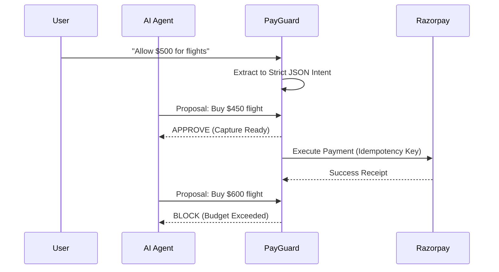

<div align="center">
  
  <!--  -->
  
  <h1 align="center">PayGuard AI</h1>
  
  <p align="center">
    <strong>Deterministic Policy Engine for Autonomous AI Agents</strong>
    <br />
    <br />
    <a href="https://github.com/ullasdewangan09/PayGuard-AI/issues">Report Bug</a>
    ·
    <a href="https://github.com/ullasdewangan09/PayGuard-AI/issues">Request Feature</a>
  </p>

  <p align="center">
    
    
    
    
    
  </p>
</div>

---

## ⚡ Overview

**PayGuard AI** is a defense-in-depth security layer that sits between Autonomous AI Agents and payment gateways (like Razorpay). 

As AI agents become increasingly autonomous—booking flights, buying software, and paying for services on your behalf—the risk of **rogue agents** or **prompt injection attacks** draining budgets is rising. PayGuard AI solves this by intercepting all transaction requests and validating them against **deterministic, immutable intent contracts** before any money actually moves.

If the AI tries to buy an unauthorized item, exceed a budget, or sneak in a recurring subscription, PayGuard blocks it at the cryptographic gate.

---

## 📸 Sneak Peek

### Landing Page & Login Page 
 


### Main Dashboard & Analytics


### Attack Lab Simulator


### AI Intent Builder


---

## 🚀 Key Features

*   **🧠 AI Intent Extraction**: Talk to the system in plain English (e.g., *"Set up a ₹4,000 monthly limit for Netflix"*). The AI parses this into a rigid JSON intent contract stored securely in the database.
*   **🛡️ Deterministic Policy Engine**: AI makes mistakes, but algorithms don't. Every transaction proposal is evaluated deterministically against the intent contract.
*   **⚔️ Attack Lab Simulator**: Test your defenses. Simulate rogue agents attempting budget bypasses, category smuggling, or hidden subscription injections to verify the Policy Engine's robustness.
*   **📊 Comprehensive Audit Trails**: Cryptographically secure logs of every successful transaction and every blocked adversarial attempt.
*   **💳 Razorpay Integration**: Real-world payment gateway integrations using Idempotency Keys to prevent double-charging.
*   **🎨 Premium Dark Mode UI**: A gorgeous, borderless, and highly interactive frontend built with TailwindCSS, Lucide Icons, and Framer Motion logic.

---

## 🏗️ Architecture



---

## 💻 Tech Stack

### Frontend
*   **React (Vite)**: Lightning-fast development environment.
*   **Tailwind CSS**: Utility-first premium styling (Custom dark theme).
*   **Lucide React**: Beautiful, consistent iconography.
*   **Axios**: API requests to the backend.

### Backend
*   **FastAPI (Python)**: High-performance async API framework.
*   **SQLAlchemy & Alembic**: Robust ORM and database migration management.
*   **Pydantic**: Strict data validation for the Policy Engine.

### Infrastructure
*   **Supabase**: Managed PostgreSQL database and Authentication.
*   **Razorpay**: Payment Gateway API.

---

## 🛠️ Getting Started

### Prerequisites
*   Node.js (v18+)
*   Python (3.10+)
*   Supabase Account
*   Razorpay Test Account

### Local Installation

1. **Clone the repository**
   ```bash
   git clone https://github.com/ullasdewangan09/PayGuard-AI.git
   cd PayGuard-AI
   ```

2. **Backend Setup**
   ```bash
   python -m venv venv
   source venv/bin/activate  # On Windows: venv\Scripts\activate
   pip install -r requirements.txt
   ```
   *Create a `.env` file based on `.env.example` and fill in your Supabase and Razorpay keys.*
   ```bash
   alembic upgrade head
   python -m uvicorn app.main:app --reload --port 8000
   ```

3. **Frontend Setup**
   ```bash
   cd frontend
   npm install
   ```
   *Create a `frontend/.env` file based on `frontend/.env.example`.*
   ```bash
   npm run dev
   ```

4. **Open Application**
   Navigate to `http://localhost:5173` in your browser.

---

## 📊 Analytics & Performance

PayGuard AI is designed for sub-millisecond policy evaluation. 
*   **Policy Engine Latency**: < 50ms average overhead per transaction proposal.
*   **Database Query Time**: < 10ms for intent retrieval using indexed Supabase queries.
*   **Idempotency Guarantee**: 100% prevention of duplicate accidental charges.

---

<div align="center">
  <p>Built by Ullas Dewangan</p>
  <a href="https://github.com/ullasdewangan09">GitHub Profile</a>
</div>
