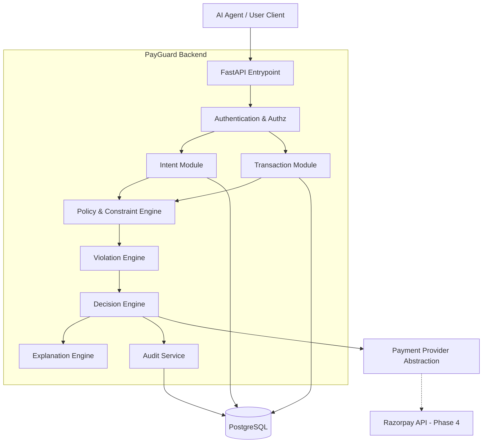
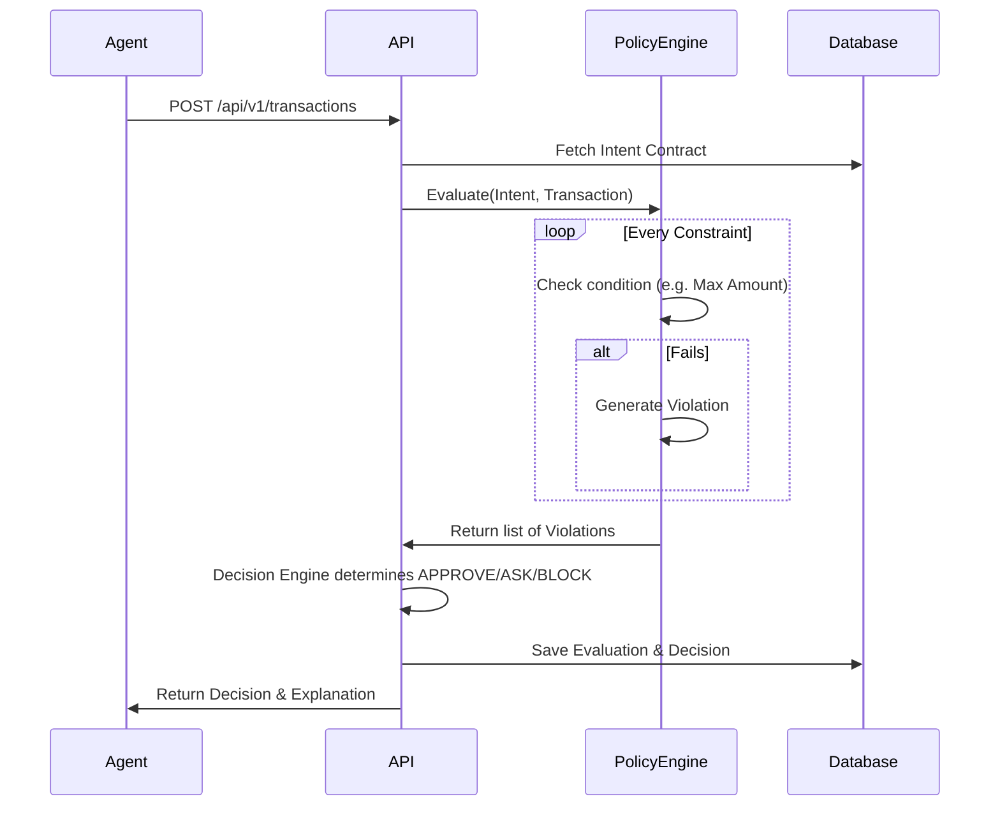
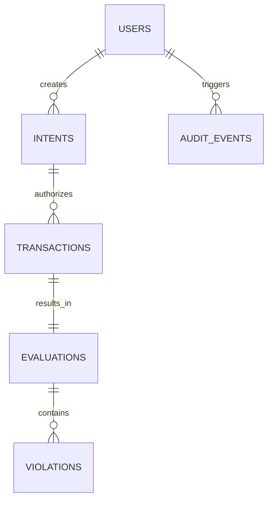

# Architecture

## System Architecture

PayGuard AI is designed as a **Modular Monolith**. This ensures simplicity and speed of development given the 10-12 day constraint, while maintaining clear boundaries between logical components.



## Request Lifecycle

1. **Intent Creation**: A user's natural language intent is parsed (externally or via an internal parser) and securely stored as an `Intent Contract`.
2. **Transaction Proposal**: An AI agent proposes a transaction by submitting a `Transaction Contract` referencing the `Intent Contract`.
3. **Evaluation**: The `Policy Engine` fetches the `Intent Contract` and compares it deterministically against the `Transaction Contract`.
4. **Violation Generation**: For every constraint that fails, a structured `Violation` object is generated.
5. **Decision Making**: The `Decision Engine` analyzes the violations and outputs `APPROVE`, `ASK`, or `BLOCK`.
6. **Explanation**: The `Explanation Engine` turns the decision and violations into a user-friendly string.
7. **Payment**: If `APPROVE`, the payload is handed to the `Payment Provider` for capture.

## Policy Evaluation Flow



## Database Relationships



## Future Razorpay Integration Boundary

The core of PayGuard must remain completely agnostic to Razorpay. We will define an abstract base class `PaymentProvider`. 

```python
class PaymentProvider(ABC):
    @abstractmethod
    def capture_payment(self, transaction: TransactionContract) -> PaymentResult:
        pass
```

In Phase 4, a `RazorpayProvider` will implement this interface. The Decision Engine will only ever call `capture_payment` on the abstraction layer, ensuring the policy evaluation logic is never tightly coupled to a specific gateway's data structures.
